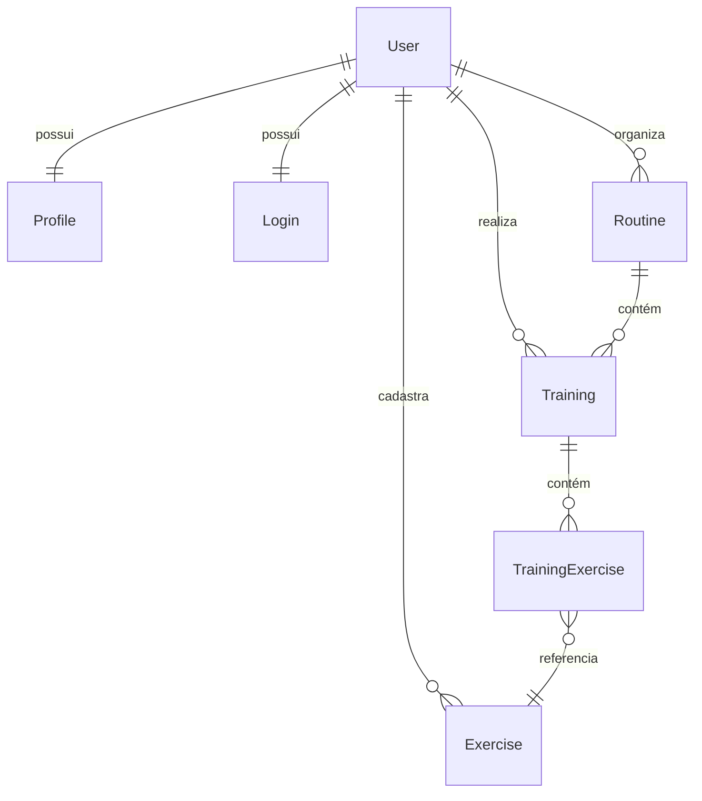

# Visão Geral do Domínio

## Diagrama de Relacionamentos



## Agregados

O domínio é organizado em torno do agregado **`User`**, que atua como raiz e ponto de entrada para as operações principais.

```
User (Aggregate Root)
├── Profile
├── Login (Value Object)
├── Exercise[]
├── Training[]
│   └── TrainingExercise[]
│       └── Weight (Value Object)
└── Routine[]
    └── Training[]
```

## Responsabilidades por Entidade

| Entidade | Responsabilidade |
|---|---|
| `User` | Gerencia identidade, autenticação e confirmar e-mail |
| `Profile` | Armazena dados pessoais e metas do usuário |
| `Exercise` | Representa um exercício com nome, descrição e categoria |
| `Training` | Sessão de treino com data e lista de exercícios |
| `TrainingExercise` | Associa exercício ao treino com séries, repetições e carga |
| `Routine` | Agrupa treinos em uma rotina nomeada |

## Value Objects

| Value Object | Uso |
|---|---|
| `Login` | Encapsula e-mail e senha do usuário |
| `Height` | Altura do usuário com validação de unidade |
| `Weight` | Peso com validação — usado em `Profile` e `TrainingExercise` |
| `Gender` | Enum de gênero usado no `Profile` |
